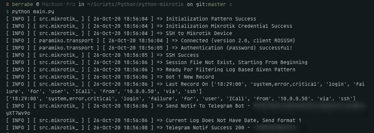
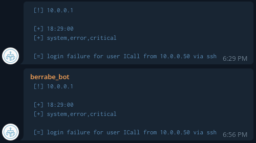

<p align="center">
  
</p>


### TLDR;
---
This python program is used to monitor, filter, and trigger log events on MikroTik RouterOS devices

the way this program works is quite simple, first this program will take logs on the MikroTik Device by making an ssh connection.

secondly, the program will filter out the word patterns that we have given / setting, for example like this `['- info', '+ ssh']`, with such a pattern, the program will get rid all logs that have the word `info` in it, either in topic and message column. and will keep logs with the word `ssh`, if the log containing the word ssh is 1 or more, the program will send a notification to the telegram bot as an alert

This program can be run anywhere, both Linux, Windows ,MacOS and agentless, meaning on the MikroTik side, no additional tools / scripts / programs are needed, **all you need is to allow ssh access to the MikroTik Device**


### USAGE
---
- a very general first step, clone this repo, and do a few steps like the steps below to make sure this program can run perfectly
```sh
git clone https://github.com/berrabe/python-mikrotik-logger.git
cd python-mikrotik-logger
pip install -r requirements.txt
```

- then, we will set some parameters that are used so that this program runs as we want, edit the **main.py** file with your favorite code editor
  - the pattern below will filter all logs which contain the word `ssh` and `critical` in them but no `info` and `logged` word, make the program catch ssh login failures, not ssh login info
  - **put the word pattern you want to get rid of / ignore before the word you want to catch**
```python
obj=mikrotik_.mikrotik_(pattern = [
			'- info',
			'- logged',
			'+ critical',
			'+ ssh'
			])
```

- the next step, fill in the credentials that are used to ssh into the MikroTik device, this is used so that the program can retrieve logs on the MikroTik Device with secure protocol and agentless
```python
obj.start(
	host = "YOUR MIKROTIK IP", 
	port = 22, 
	username = "YOUR MIKROTIK USER", 
	password = "YOUR MIKROTIK PASSWORD"
	)
```


- You can see the most recent logs filtered by this program in the terminal by using this command
```python
obj.show()
```

- and if you want to activate telegram notifications if there is a new log, you can use this function, make sure you already have a telegram bot token and also a chat id
```python
obj.notif_telegram(
  token = 'YOUR TELEGRAM BOT TOKEN', 
  chatid = 'YOUR TELEGRAM CHATID')
```

- lastly, run this program with the command
```sh
python main.py
```

- You can also see in realtime what this program is doing in the mikrotik.log file in the same folder as main.py
```sh
cat mikrotik.log
```

### SCREENSHOT
---
<p align="center">
  
  <br>
</p>

<p align="center">
  
</p>