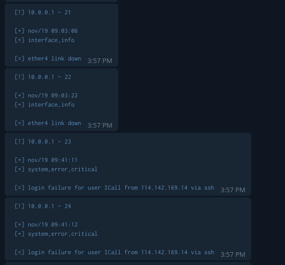

<p align="center">
  
</p>

<br/><br/>
### TLDR;
---
This python program is used to monitor, filter, and trigger log events on MikroTik RouterOS devices

the way this program works is quite simple, first this program will take logs on the MikroTik Device by making an ssh connection.

secondly, the program will filter out the word patterns that we have given / setting, for example like this `['- info', '+ ssh']`, with such a pattern, the program will get rid all logs that have the word `info` in it, either in topic and message column. and will keep logs with the word `ssh`, if the log containing the word ssh is 1 or more, the program will send a notification to the telegram bot as an alert

This program can be run anywhere, both Linux, Windows ,MacOS and agentless, meaning on the MikroTik side, no additional tools / scripts / programs are needed, **all you need is to allow ssh access to the MikroTik Device**


<br/><br/>
### MikroTik Configuration
---
I recommend some settings for mikrotik device(s) so that the python-mikrotik-logger program can work smoothly
- First, move all log storage modes from default (memory) to disk, this is highly recommended considering mikrotik will clear all logs if the router shuts down / reboot
```sh
# add action mode called PythonMikrotikLogger
> /system logging action add name="PythonMikrotikLogger" target=disk disk-file-name="PythonMikrotikLogger" disk-lines-per-file=2000 disk-file-count=1 disk-stop-on-full=no

# change all log topic to PythonMikrotikLogger action
> /system logging set [/system logging find where action!="PythonMikrotikLogger"] action=PythonMikrotikLogger
```

- Second, for security reasons, create a user with restricted permissions only to ssh and retrieve logs
```sh
# add group called monitoring
> /user group add name="monitoring" policy=ssh,ftp,read,!local,!telnet,!reboot,!write,!policy,!test,!winbox,!password,!web,!sniff,!sensitive,!api,!romon,!dude,!tikapp skin=default

# add user called monitoring with group monitoring
> /user add name="monitoring" group=monitoring password=<YOUR CUSTOM PASSWORD>
```


<br/><br/>
### USAGE
---
- first step, clone this repo, and do a few steps like the steps below to make sure this program can run perfectly
```sh
> git clone https://github.com/berrabe/python-mikrotik-logger.git
> cd python-mikrotik-logger
> pip install -r requirements.txt
```

- then, we will set some parameters that are used so that this program runs as we want, edit the **hosts.yml** file with your favorite code editor
```yaml
mtk_devices:
  patterns:
    - '- hotspot'
    - '- monitoring'
    - '+ error'
    - '+ logged'
    - '+ warning'
    - '+ link up'
    - '+ link down'
    - '+ rebooted'
    - '+ critical'
    - '+ failure'


  vars:
    telegram_token: < YOUR TELEGRAM TOKEN >
    telegran_chatid: '< YOUR TELEGRAM CHAT ID >'


  hosts:
    host_1:
      mtk_host: < MIKROTIK HOST IP / DOMAIN >
      mtk_port: < MIKROTIK SSH PORT >
      mtk_username: < MIKROTIK LOGIN USERNAME >
      mtk_password: < MIROTIK LOGIN PASSWORD >

```

- lastly, run this program with the command
```sh
> python3 main.py

# if you need some verbose output of what this program is doing
> cat python-mikrotik-logger.log
```

<br/><br/>
### SCREENSHOT
---
<p align="center">
  
</p>

<p align="center">
  
</p>

<p align="center">
  
</p>

<p align="center">
  
</p>